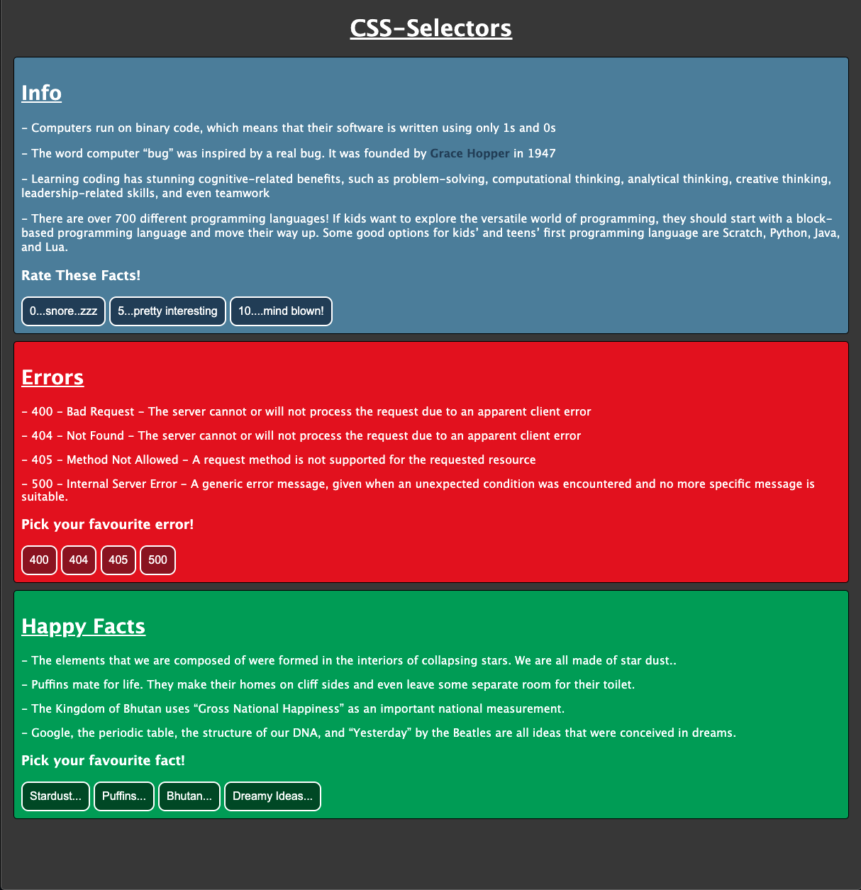

# Introduction To CSS-Selectors

## What are CSS Selectors?

> CSS Selectors allow us to specify the elements to which a set of CSS rules apply.

### Examples of CSS Selectors:

- **Type Selector** - Selects all elements that have the given element name

```html
<p>The computer virus wasn't designed to be harmful!</p>

<p>Spacecraft run on 1970s computer coding!</p>

<p>Coding can make you a billionaire...apparently!</p>
```

CSS Syntax:

```css
p {
  letter-spacing: 2px;
}
```

---

- **ID Selector** - Selects an element based on the value of it's id attribute

```html
<div id="example_id">...content</div>
```

CSS Syntax:

```css
#example_id {
  font-size: 1rem;
}
```

---

- **Class Selector** - Selects all elements that have that class attribute

```html
<p class="greeting">Hello! Welcome to CSS Land!</p>

<p class="greeting">Hey there! You got some style!!</p>

<p class="greeting">
  Howdy partner! If I give you 'de-sign', you know what to do!
</p>
```

CSS Syntax:

```css
.greeting {
  font-weight: bold;
}
```

---

Here are some other CSS Selectors that you can research but there are many more that we can use when styling with CSS..

- attribute selectors

- child-selectors

## TASKS:

We have created a HTML skeleton of for a page containing three sections of information and we want you to use some CSS Selectors to style it!

### Articles:

- use the Type Selector to style your articles uniformly
- combine border, padding and margin to position your paragraphs in each article
- add a background colour to each article (you might want to use a different type of selector in order to use different background colours for each article....)

---

### Headers:

- use the Class Selector to style your headers
- should be capitalised (don't cheat and change the html file 🧐)
- should be underlined

---

### Buttons:

- should have a border
- make use of padding to design your buttons
- make use of margin to position your buttons in relation to one another
- should be a similar shade to the article colour that they are contained within (hint...could an element have more than one class selector.....)

---

### Extra Tasks:

- Grace Hopper was an incredible woman so let's make her name **stand out!** Think about how we could use an inline element to make her name bold without changing the structure of our 'Info' article

- The 'Errors' article needs to stand out more! Let's make the paragraphs for this article ONLY - _italic!_

- The 'Happy Facts' article also needs to stand out! Let's make the paragraphs for this article ONLY - CAPITALISED

- Check out the example below of how you could possibly design these articles...


