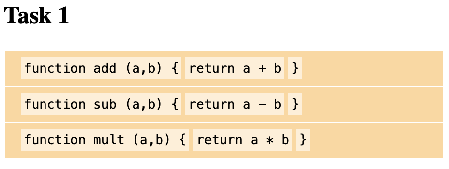
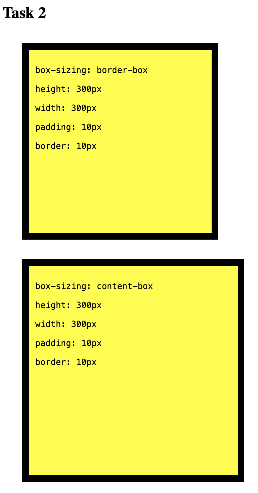
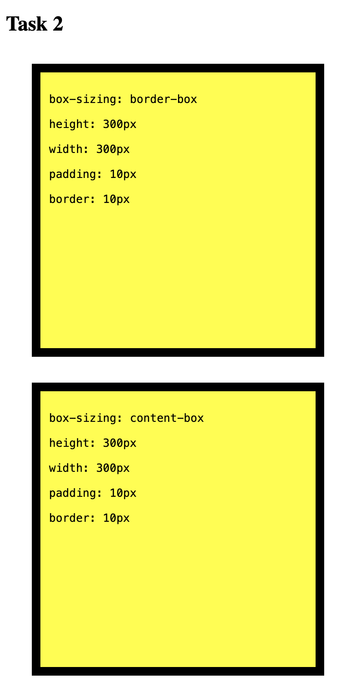

# box-model

## Everything is a box 🗳️

On a webpage everything is a box. Whether it's a `<div>`, `<ul>`, `<p>`, `<span>` or anything else it will be positioned and rendered in a rectangle.

The shape, size, and exact positioning of an element will depend on various properties including:

- `display`
- `padding`
- `margin`
- `border`
- `box-sizing`
- and more...

---

## `block` and `inline`

Most HTML Elements have some default styling applied to them ([Read more: css default values](https://www.w3schools.com/cssref/css_default_values.asp))

For example a `<div>` will, by default, have:

```css
display: block;
```

`block` will cause elements to:

- Break onto a new line
- Take up the horizontal space of its parent element

`inline` will cause elements to:

- **Not** break onto a new line
- Take up only the horizontal space of its contents + padding

You may overwrite an HTML elements default styling by using CSS

---

## `box-sizing`

In the standard box model the `height` and `width` effects the inner contents box of an element _only_.

This can make things a bit confusing because `height` and `width` are **not** the actual height and width of the element - there's padding and border added on!

To make things simpler you can choose to use the alternate box model which sets the size of the inner contents box to be `height` and `width` _minus_ `padding` and `border`. This way `height` and `width` will be the actual size of the element!

The `box-sizing` attibute can be used to switch between the standard box model and the alternate box model

```css
/* standard */
box-sizing: content-box;
/* alternate */
box-sizing: border-box;
```

---

## Tasks

### 1. Inline Vs. Block

1.  Style the `<code>` elements so each appears as a `block` and not `inline` like they are by default.
2.  Add `<span>` tags to the `html` to allow you to change the colours to match the wireframe below (or your own VSCode theme!)
3.  Change the `display` property of the `<section>` tags so that they appear side-by-side!

> before...



> after...


---

### 2. Box sizing

change the `height` and `width` properties of the `border` box to make it the same size

> before...



> after...


