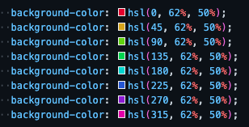
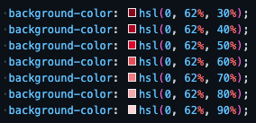

# Colours

It's time to look at colours! CSS offers forward so many different ways in which we can add colour to our styling! It really is an endless adventure!

This kata will require you to colour in some flags from around the world using the different colouring options available to us in CSS.

### Take some time to look up..

---

- web colours(generic colours available to us in CSS)

```css
.flag {
  background-colour: green;
}
```

---

- Hexidecimal colour codes

```css
.flag {
  background-colour: #3f3f3f;
}
```

---

- RGB colour codes

```css
.flag {
  background-colour: rgb(34, 45, 234);
}
```

---

- HSL colour codes

```css
.flag {
  background-colour: hsl(45, 100%, 50%);
}
```

---

## TASKS:

### Task 1:

For this task you will need to add some standard web colours to the first row of flags to match the following countries:

- Italy
- Belgium
- Monaco

### Task 2:

For this task you will need to add some hexidecimal colours to the second row of flags to match the following countries:

- Armenia
- Bahamas
- Chad

### Task 3:

For this task you will need to add some rgb colours to the second row of flags to match the following countries:

- Estonia
- Laos
- Yemen

### Task 4:

For this task you will need to add some hsl colours to the second row of flags to match the following countries:

- Niger
- Luxembourg
- Sierra Leone

## NOTES ABOUT TASKS

- there are guides in the CSS file to show you where to insert your background colours for each specific flag.

- If the colours are horizontal, 'first background-color' will refer to the left most column. If the colours are vertical, then 'first background-color' will refer to the row at the top of the flag.

- All other elements that may need colouring are indicated

- when you have completed all of the flags, feel free to remove any outlines, but leave ALL borders in place.

- If you are feeling confident, have a go at designing your own flag, we would love to see your wonderful colourful creations!

---

### Extra Task - HSL

`hsl` - or "hue, saturation and lightness" - is a CSS function that returns a colour.

It's arguments `hsl(<hue>, <saturation>, <lightness>)` can be adjusted individually to fine-tune a colour's components without affecting the others.

For example you may create a rainbow with the same saturation and lightness by adjusting the `hue`



Or adjust the lightness only



### Task 5:

- Flip the `hue` of the `hsl` flags around the colour wheel 180 degrees!
