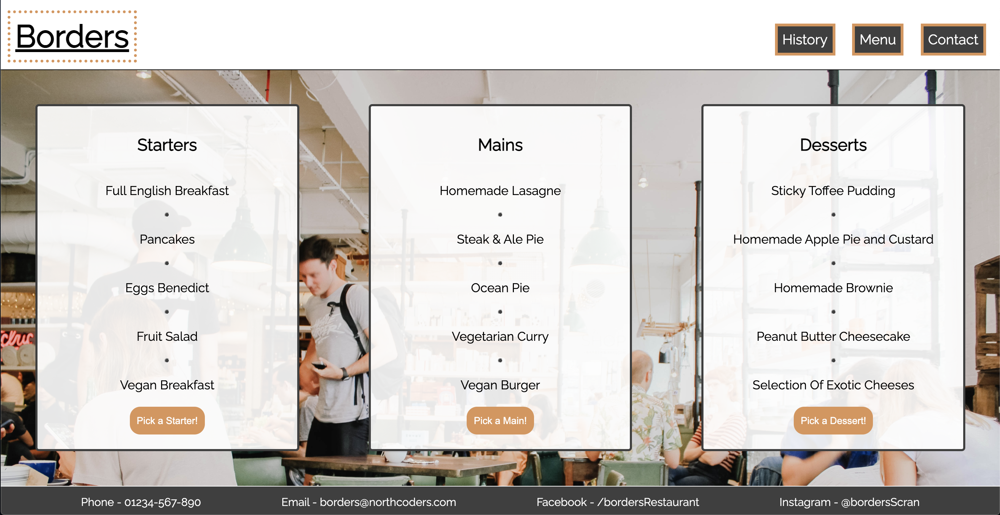

# Borders

Wow... that was a lot of flags! However, it is time to move on to another fabulous CSS topic - **Borders**!

Borders allow us to navigate the different elements and content on a page without us even realising they are doing so! They are reeallly powerful design tools!

## CSS Syntax:

There are many ways in which we can style using borders and we are going to take a look at a few of them here before getting stuck into the kata.

```css
.flag {
  border: solid;
}

This is the most basic CSS syntax available to us for styling borders. CSS with by default set the width and colour of our border if we use this basic syntax. The colour will be set to black.
```

---

```css
.flag {
  border: dotted red;
}

Here we are being a little bit more specific and specifying a style and a colour for our border. This width will still be set to a default value by CSS.
```

---

```css
.flag {
  border: 1px solid black;
}

In this syntax, we are adding specificity to each part of our border. We have set a 'border-width', 'border-style' and 'border-color'.
```

---

> NB - you could also use three individual selectors instead of the shorthand in the above example. See in the example below...

```css
.flag {
  border-width: 1px;
  border-style: solid;
  border-color: black;
}
```

---

CSS will also allow you the option of interchanging which choice of colour designation you would like to use, as well as allowing you to interchange measurement units.

```css
.flag {
  border-width: 0.4rem;
  border-style: solid;
  border-color: #3f3f3f;
}
```

```css
.flag {
  border-width: 1em;
  border-style: dotted;
  border-color: rgb(34, 132, 89);
}
```

> These are also valid ways for designing and styling borders.

---

### Border Radius:

We can also use the **border-radius** to style an element's outer border edge!

Using border we can add a specific amount of radius to each corner using a single value, or if we choose, target each corner individually.

```html
<div class="circle"></div>
```

```css
.circle {
  width: 100px;
  height: 100px;
  border-radius: 50%;
}
```

The above is a common was in which we can target all corners - an effective way to make a circle for example! Below is a way in which can be more specific with our values for each corner.

---

```html
<div class="shape"></div>
```

```css
.shape {
  width: 150px;
  height: 300px;
  border-radius: 10px 2rem 5% 40px;
}
```

> Note how we can use different unit values when creating our borders. General consensus would be to stick to one though, as it makes for much cleaner and easier to understand code.

## TASKS:

In this kata we are excited to let you know that Northcoders has opened a restaurant! And we have created a menu that we need help with! If you open the **border.html** file with the **Live Server extension**, you will a menu with some fabulous dishes. It is quite difficult however to make out which section is which and this is where we need you!

Before starting these tests, have a little google to see how we can also target specfic sides of a container(hint..**border-left**..for example!)

### Task 1:

- We need some separation between our courses! Styling the **Starters** and **Desserts** courses, style the menu using borders so that there is a dividing line between each course!(you should be able to do this without adding any styling to the **Mains** section and you should need to create two lines only!)

### Task 2:

- The headings for each course could do with standing out a little more! Think about how we could use a border to underline these headers! (Don't cheat and use **text-decoration** otherwise you will be barred for life!)

### Task 3:

- The header section of website is generally where we can navigate to different parts of a site. Use border styling to divide this section from the rest of the menu page! Try varying the units that you have been using so far and let's try a different **style** of border.

### Task 4:

- Similarly we need to make sure that the footer at the bottom of our page is separated also! Separate it from the the menu section using border styling!

## Task 5:

- Now let's use some **border-radius** to add some styling to the menu buttons! Think about how you could use **padding**, **margin** and some **background coloring** that you have learned in previous katas, to make the buttons really stand out.

Once you have completed all these tasks, feel free to add to this menu page and style it any way you like! Below is an example of how you could style this page and how useful borders can be when needing to separate elements of a page :)!


