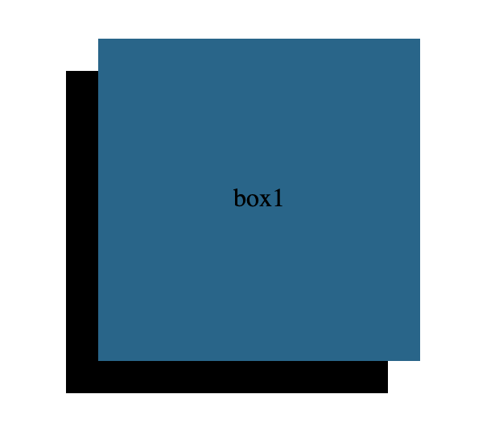
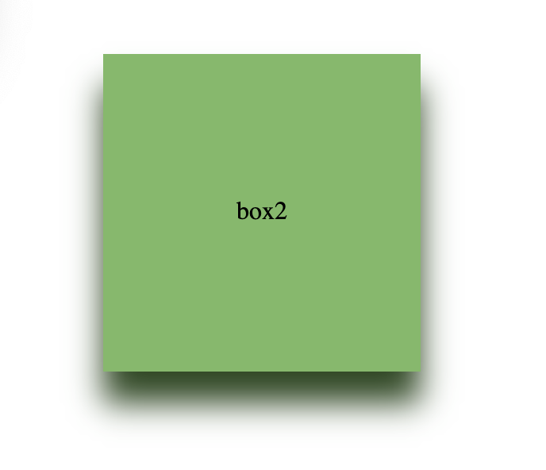
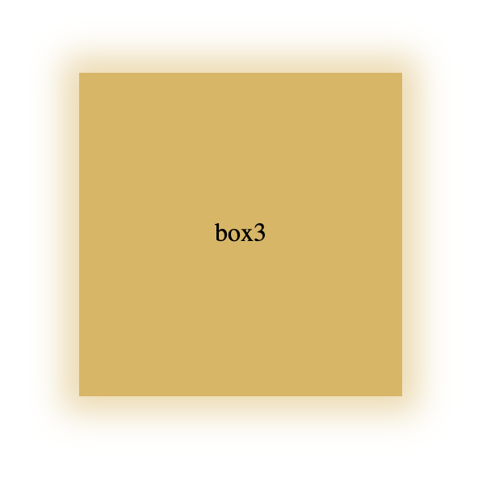
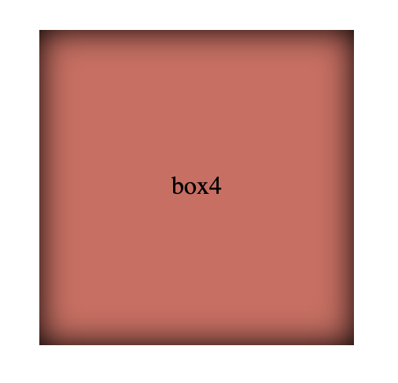

# box-shadows

## Tasks

### 1. solid drop shadow

- Apply a solid `box-shadow` offset diagonally (down + left) with no blur

> 🎨 Aim to make it look retro and bold!



---

### 2. blurred box shadow

- Apply a `bow-shadow` with an offset to position it below the box
- Copy the colour of the box and using `hsl` adjust the 'lightness' of the shadow to make the shadow **darker**
  > 🎨 Aim to make the box 'hover' off the page!



---

### 3. light blur 'glow' effect

- Add a `box-shadow` with no offset
- Copy the colour of the box and using `hsl` adjust the 'lightness' of the shadow to make the shadow **lighter**
- Increase the `spread-radius` to make the glow more visible

> 🎨 Aim for subtlety!



---

### 4. Inset shadow

- Add a `box-shadow` with no offset
- Set the `box-shadow` to be `inset` inside the `<div>`
- Add a blur
- Either colour the shadow `black` or copy the box's `hsl` and adjust the `lightness` to be darker (let Doug know which one you prefer 💅)

> 🎨 Aim to make the box appear "sunk" into the page!



---

### 5. Make Northcoders more snazzy!

You can add shadows to text too using `text-shadow`!

You can also add multiple `box-shadow` and `text-shadow` effects to an element by comma-separating the effects.

i.e

```css
text-shadow: black 10px 10px, yellow 15px 15px, black 20px 20px;
```

- Add multiple solid `text-shadow`s to the "Northcoders" text
- You choose the colour, direction and amount!
- You may want to change the colour of the `<p>` too to suit your design

> 🎨 Aim to make the colours work together in a nice pattern or gradient!


