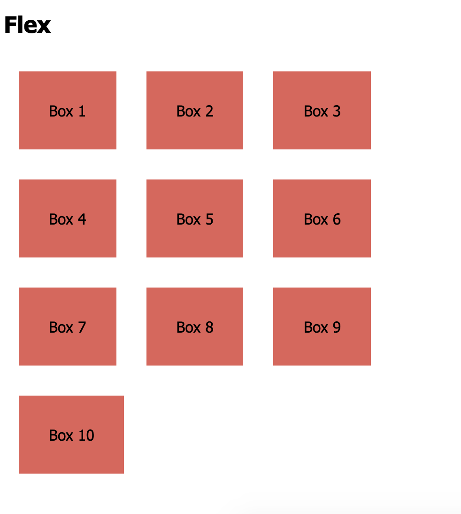
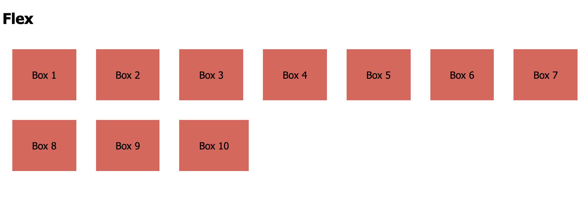
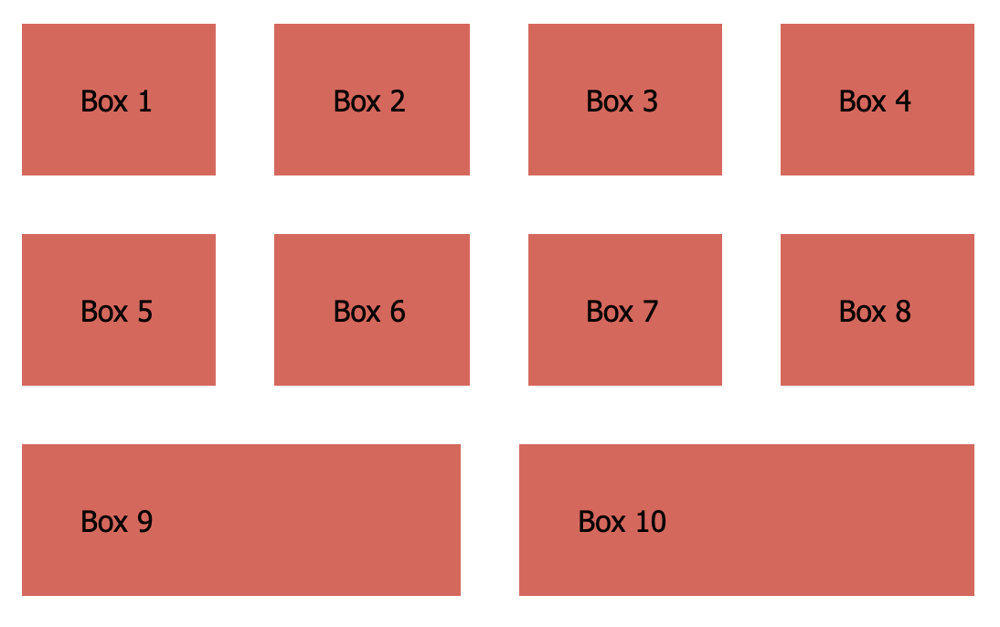

# Flex

**Goal**:

- Apply flex to make the boxes align themselves left-to-right
- Boxes should continue on the next row once they reach the edge of the window

> Narrow Screen View
> 
> Wide Screen View
> 

**Extra Credit:** Let the boxes fill up that wasted space

> 
