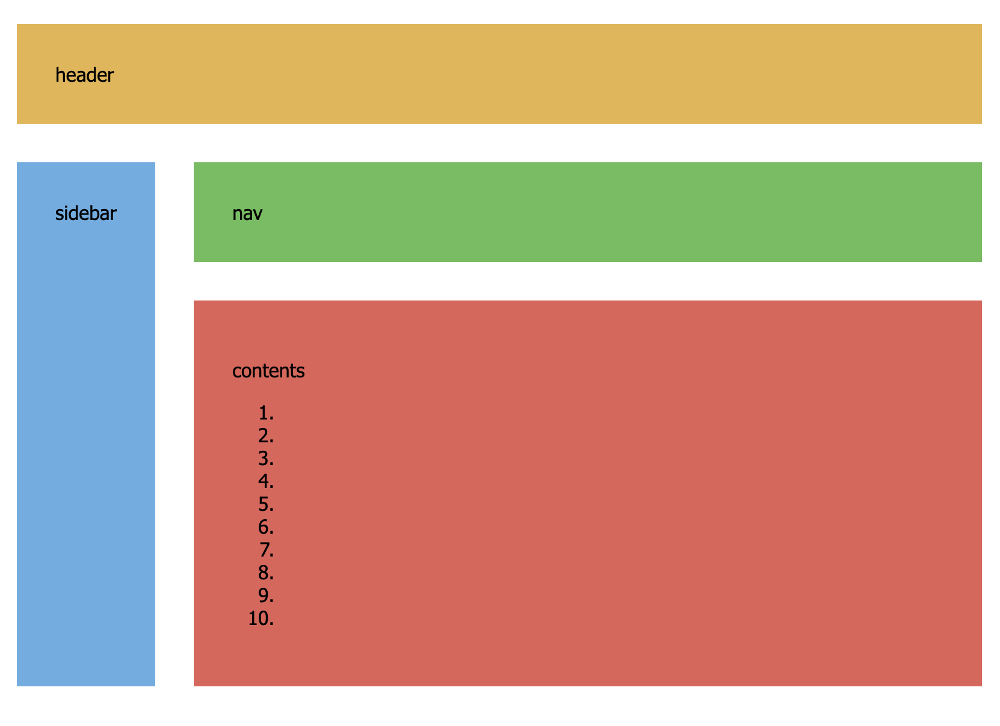

# Grid

**Goal**:

- Align the components of this page in a grid. They should maintain this shape no matter what size the browser window is.
- The `sidebar` should be a _fixed_ width and _not_ expand/shrink when the browser window is resized.
- The `content` and `sidebar` components should expand downwards when more content is added.

