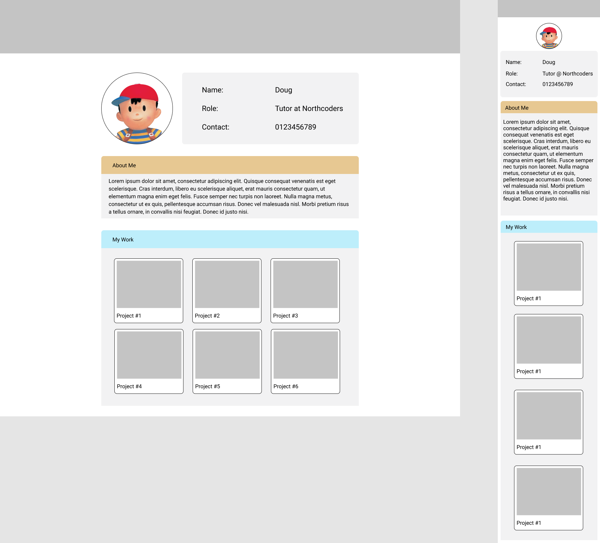

# responsive-design

## Responsive

**Goal**: Recreate this wireframe from scratch!

- The layout must adjust between desktop and mobile view.
- The "About Me" section should allow for more/less text inside (no fixed height!)
- The "My Work" cards should fill their container left-to-right, continuing on the next row once they reach the edge of their container.

Tips:

- You might find it easier to start with the mobile version before adding the adjustment for desktop view.
- You can use your own images, colours and content if you'd like
- The image used in the wireframe is in `/images/profile-picture.png`

> Desktop (left) and Mobile (right) views
> 

**Extra credit**: Give the "My Work" cards a hover effect that makes them appear "raised" with a subtle shadow effect when the user moves the mouse cursor over it.
