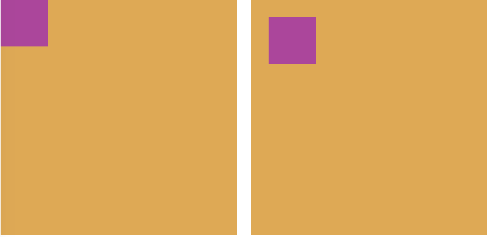

# Position

Positioning is one of the most powerful tools available to us in CSS and when you come to designing websites and mobile apps. It is something that will become part of your everyday arsenal of creative tools.

In this kata, we are going to look at three types of positioning (but there are more for you to look up in your own time :P!)

---

## Relative positioning

We use `position:relative` when we want to position something relative to its normal position.

Relative positioning works alongside directional properties: `top`, `bottom`, `left` and `right`. Adding length values to these properties (e.g. `10px`, `2rem` etc.) allows us to place the element exactly where we need it to be.

For example, adding `right: 10px;` will move this element ten pixels away from the right edge of its normal position. This might seem confusing at first - `right: 10px;` moves our element to the *left* instead of the *right* - but it might help to think of this property as declaring **the distance away from the named edge**.

```css
.box {
  position: relative;
}
```

---

## Absolute positioning

We use `position:absolute` when we want to position an element relative to its parent element.

If none of its parent elements has an attribute of `position: relative`, then by default the element will absolutely position itself to `0, 0` (**top left**) of the `body` element in the HTML, before applying any values from directional properties.

```html
<div class="parent">
  <div class="child"></div>
</div>
```

```css
.parent {
  width: 400px;
  height: 400px;
  position: relative;
}

.child {
  width: 100px;
  height: 100px;
  position: absolute;
  top: 30px;
  left: 30px;
}
```



In the example above, the left image shows the default positioning of the **child** element when setting its position to **absolute**. The right image shows how the square changes position when the `top` and `left` properties are each set to 30px.

---

## Fixed positioning

We use `position:fixed` when we want to position an element relative to the browser window, *regardless of the scroll position of the page*.

One of the most common uses of this styling is to fix the header of your website to the top of the page, keeping it constantly visible, whilst the rest of the page has normal scrolling functionality. It gives the appearance of the page content moving behind the header as you scroll.

```css
.box {
  position: fixed;
}
```

Once you have completed all your tasks, there is some code that you can uncomment to see `position:fixed` in action! Make sure you complete all of the following tasks first!

---

## TASKS

As you can see, we have entered Northcoders' very own retro games arcade!

### Game 1

- Your task is to rearrange the squares using the **right, left, top and bottom** position properties only so that each square is positioned in the correct corner!

### Game 2

- It's time to rearrange some circles! Using the **top** position property, align each circle to its matching beam!

> NB: It may be tempting to just copy the other values, but try and increment the **top** position property to get a feel for how far the circles move, depending on the value you enter!

### Game 3

- Finally, you have to help Player One escape! Using the **top** and **left** position properties, guide player one through the obstacle course to safety at the end!

### Finally...

Now you have done all the tasks:

- scroll the page
- uncomment lines **27 - 28** & **44 - 47** in `position.css`
- scroll the page again

What's changed? How does the page behave now?
