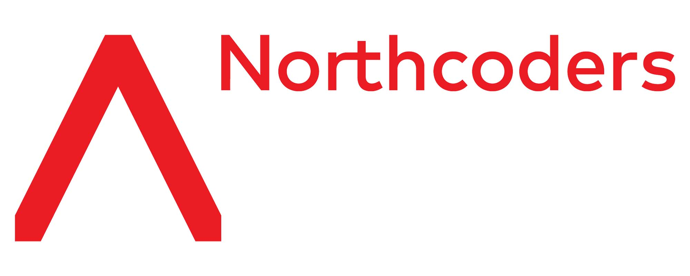

## Northcoders Frontend Project



This web application connects to the Back-End Project and displays all data about the articles provided. You as a user can also Sign-in, Like or Comment on each article.

## Useful Links

- [x] [Live Website](https://northcoders-news-frontend-v2.netlify.app/)
- [x] [Northcoders](https://northcoders.com/)

## Tools and technologies

```json
{
  "Languages": {
    "JavaScript": true
  },
  "Libraries": {
    "React": true,
    "React-router-dom": true,
    "React-toastify": true,
    "React-parallax-tile": true,
    "React-loading": true,
    "Font-awesome": true,
    "Bootstrap": true,
    "Axios": true,
    "Netlify-cli": true
  }
}
```

## Getting started

```yaml
$ git clone https://github.com/gwdawson/northcoders-frontend-project.git
# Clones the repository into the current directory.

$ cd northcoders-frontend-project
# Changes the current directory to the northcoders-frontend-project directory.

$ npm install
# Installs all the dependencies.

you can run several commands:

$ npm start
# Starts the development server.

$ npm run build
# Bundles the app into static files for production.

$ npm test
# Starts the test runner.

$ npm run eject
# Removes this tool and copies build dependencies, configuration files
# and scripts into the app directory. If you do this, you can’t go back!
```

# License

All repositories distributed under the NULL License. See [`NULL`]() for more information.
